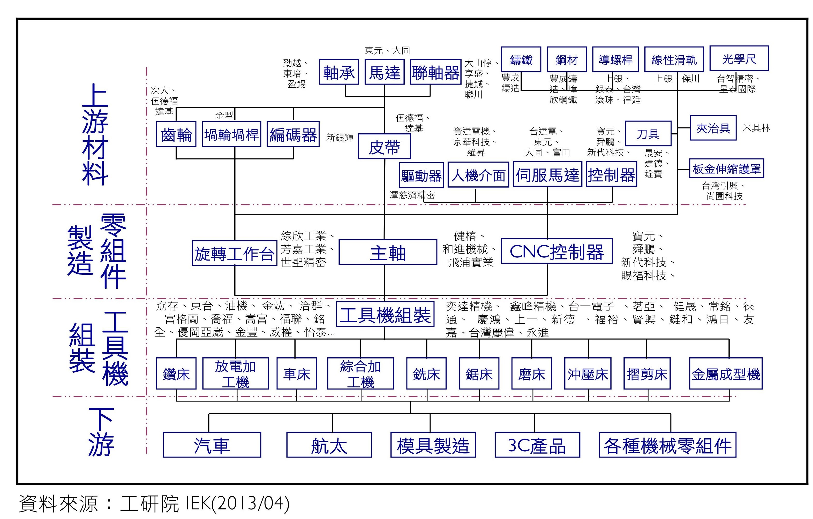

# 金屬玻璃-工具機產業

## 我國工具機產業結構

---

## 台灣工具機最大廠-東台 104 年度營收要點

營業比重：

以綜合切削中心機與 CNC 車床主要核心產品。兩樣商品的品項說明如下：

重要用途如下：

主要原料供應狀況：

---

## 東台之主要原料供應商

### NSK 日本精工

NIPPON  SEIKO 日本精工株式會社（NSK , http://www.nsk.com）創立於1916年，是日本最早開始著手於軸承生產之軸承製造廠，目前則為全日本最大、世界最大軸承製造業者之一。

**台灣安士克精密股份有限公司**(http://www.tw.nsk.com)為日本 NSK 在台灣之現地法人。
台北市104松江路87號11樓

###  THK

公司的旗艦產品是在軌道上行進的可移動零件和螺桿，稱為 [直線運動導軌](https://zh.wikipedia.org/wiki/LM_%E6%BB%9A%E5%8A%A8%E5%AF%BC%E8%BD%A8)

**台灣帝業技凱股份有限公司** （www.thk.com/?q=tw）為日本 THK 在台灣之現地法人。
台北市士林區承德路四段192-1號7樓

### 上銀

上銀科技股份有限公司，主要從事精密滾珠螺桿及線性傳動元件研發與製造、工業用機器人的研發與製造，為全球第三大滾珠螺桿廠和線性滑軌廠，僅次於日本[THK](https://www.moneydj.com/KMDJ/wiki/WikiViewer.aspx?Title=THK)、[NSK](https://www.moneydj.com/KMDJ/wiki/WikiViewer.aspx?Title=NSK)。

台中市精密機械園區精科路7號

### 銀泰

成立於西元1990年，主要生產滾珠導螺桿、線性導軌及線性模組，係為精密機械關鍵性零組件。

台中市神岡區大富路20巷71號

---

## 銑削刀具

除了螺稈、導軌與軸承，銑削刀具應該會是工具機原料中對鍍膜需求最為強烈的品項。台灣刀具市場多為中小型公司把持，大部分僅是代理國外生產的刀具，供應給如東台等工具機組裝廠商，所以究竟是在那一個環節進行鍍膜，意或是最適合我們尋求合作，這還還需要進一步釐清相關產業結構。

 
### 建德刀具有限公司

建德刀具有限公司 優質鎢鋼切削工具專業代理
總公司：台北市大同區承德路二段 12 號 6 樓　|　電話：02-2555-2876　|　傳真：02-2556-8046
代理品牌：KORLOY, DINOX, MIRCONA, YESTOOL, BECKER, CUTWELL

---

## 中國金屬玻璃廠商

偶然間看到的中國金屬玻璃廠商，目前看起來它僅銷售原料，沒有提供其他服務（鍍膜或授權...等）。

---

## 第 26 屆台北國際工具機展

第 26 屆台北國際工具機展，March 7-12 2017，[https://www.timtos.com.tw/zh_TW/index.html](https://www.timtos.com.tw/zh_TW/index.html)。
以上相關廠商皆會參展。

---

## 參考資料

http://p.t.qq.com/longweibo/index.php?id=441703007560168
www.1688.com/store/9EC27368EA2AA25AE172D1C762EED987.html
東台 104年度年報